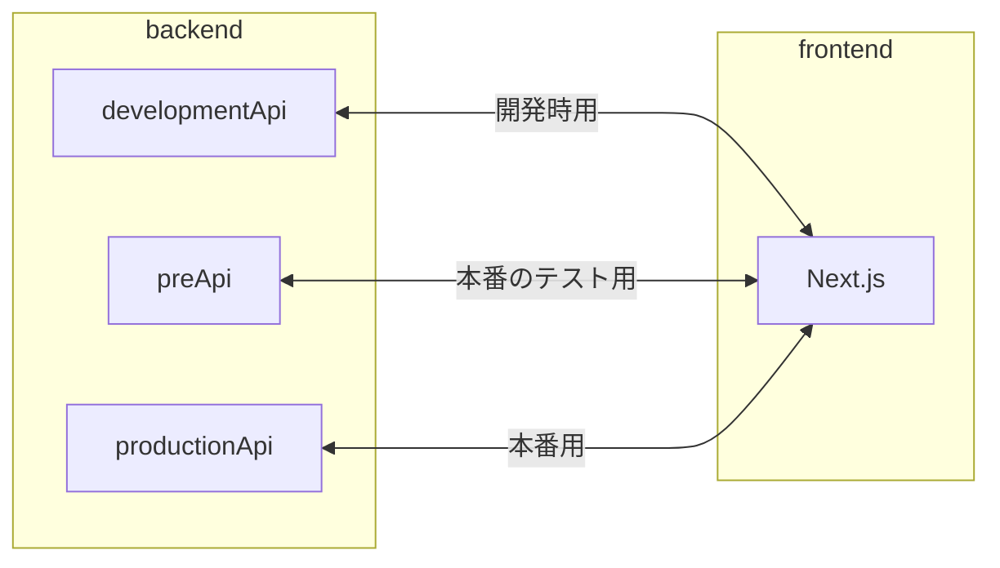
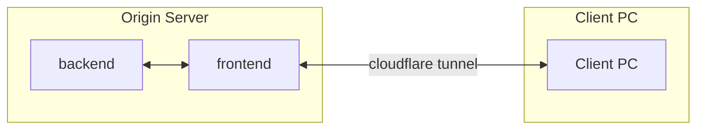
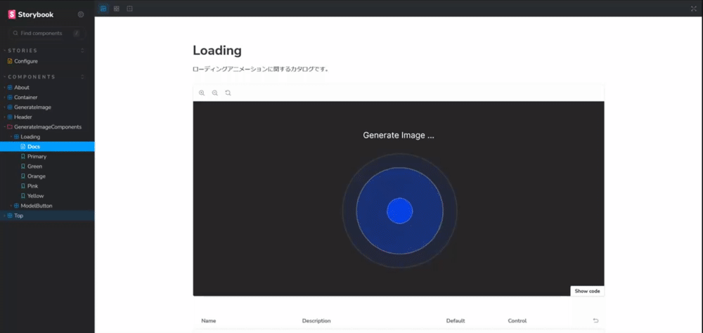

# stableDiffusion4R_API

> [!WARNING]
> 現在開発中です。


  <p align="center">
      <a href="https://github.com/kumeS/stableDiffusion4R_API" alt="Contributors">
          
      </a>
      <a href="https://github.com/kumeS/stableDiffusion4R_API" alt="Version">
          
      </a>
      <a href="https://github.com/kumeS/stableDiffusion4R_API" alt="forks">
          
      </a>
      <a href="https://github.com/kumeS/stableDiffusion4R_API" alt="forks">
          
      </a>
  </p>

## 概要

### backend

本番環境: backend/productionApi (plumber を使用)

- LICENSE Apache 2.0
- 使用言語: R
- port: 8000

本番のテスト環境: backend/preApi (plumber を使用)

- LICENSE Apache 2.0
- 使用言語: R
- port: 8000

開発環境: backend/developmentApi (Hono を使用)

- LICENSE MIT License
- 使用言語: TypeScript
- port: 8787

### frontend

Next.js: frontend

- LICENSE MIT License
- 使用言語: TypeScript
- port: 3000

storybook: frontend

- コンポーネントのタカログを見るもの
- port: 6006

## 概略図



## 本番環境の概略図



## Web API に関して

> [!TIP]
> モデルを追加する際には、必ずお読みください。

> [!IMPORTANT]
> バックエンドのエンドポイントとmodelTypeの要素名は一致させる必要があります。

##### バックエンドのエンドポイントを書くファイル -> `/backend/productionApi/plumber.R`

##### modelTypeが書いているファイル -> `frontend/src/constants/api.ts`

##### バックエンドのエンドポイントを`/modelA/<prompt>`としている場合、`modelType: string[] = ["modelA"]`とします。

> [!WARNING]
> 以下の説明は、エンドポイントの名前をモデル名としているという設定で、説明しています。

### フロントエンド側の Web API に関係する設定

#### frontend/src/constants/api.ts

```typescript
const modelType: string[] = ["stableDiffusion4R", "modelA", "modelB", "modelC"];

export { modelType };
```

modelType ・・・ モデルの名前を書きます。

※ モデルを追加する場合は、modelType にモデル名を追加してください。

### バックエンド側の Web API に関する設定 (plumber)

> [!NOTE]
> エンドポイントは、`/モデル名/<prompt>`で設定する必要があります。

> ※フロントエンドでは以下の URL が組み立てられます。
> [`frontend/.env` 内の NEXT_PUBLIC_API_URL]/[modelType]/[prompt]
> example) http://127.0.0.1:8787/stableDiffusion4R/hello

### 想定しているバックエンドが返すデータの構造

※フロントエンドでは、このデータ構造でバックエンドがデータを返すことを想定して作成しています。

```json
{
  "prompt": ["プロンプト"],
  "url": ["画像のURL"]
}
```

/backend/productionApi/plumber.R

以下のプログラムの場合は、モデル名が「stableDiffusion4R」になります。

```r
library(plumber)
library(stableDiffusion4R)


#* @filter cors
cors <- function(req, res) {
  res$setHeader("Access-Control-Allow-Origin", "*")
  if (req$REQUEST_METHOD == "OPTIONS") {
    res$setHeader("Access-Control-Allow-Methods", "GET")
    res$setHeader(
      "Access-Control-Allow-Headers",
      req$HTTP_ACCESS_CONTROL_REQUEST_HEADERS
    )
    res$status <- 200
    return(list())
  } else {
    plumber::forward()
  }
}

#* Generate Dalle Image for R
#* @param prompt プロンプトを入力してください。
#* @get /stableDiffusion4R/<prompt>
function(prompt) {
  content <- prompt
  results <- generateDalleImage4R(content, Output_image = F, SaveImg = T)
}
```

## 本番環境のセットアップ (Docker を利用しない場合)

> [!NOTE]
> `Node.js`・`npm`・`yarn`が必要です。

> [!NOTE]
> 本番環境では、frontend を cloudflare tunnel を利用して配信することを想定しています。

1. cloudflare tunnel を作成します。

- Service は、`http://localhost:3000`にします。

- ホストマシンの環境に合わせて、cloudflare tunnel をセットアップしてください。

2. `.env`ファイルを作成し、`.env.prod.example`を参考に適切に環境変数を設定します。

- `.env`ファイルは、`gen_dotenv.cmd`(Windows 環境の場合)か`sh gen_dotenv.sh`(Linux 環境の場合)を実行することで生成できます。(初回時のみ実行してください。)

- `NEXT_PUBLIC_API_URL`は、`.env.prod.example`に書いている情報をそのまま使ってください。

- `CLOUDFLARE_TUNNEL_TOKEN`は、何も書かなくて OK です。

以下のようになっていれば、OK です。

#### `.env`

```.env
#*dev
# NEXT_PUBLIC_API_URL=http://localhost:8787

#*pre
# NEXT_PUBLIC_API_URL=http://localhost:8000

#*production
NEXT_PUBLIC_API_URL=http://localhost:8000
CLOUDFLARE_TUNNEL_TOKEN=
```

#### `frontend/.env`

```.env
#*dev
# NEXT_PUBLIC_API_URL=http://localhost:8787

#*pre
# NEXT_PUBLIC_API_URL=http://localhost:8000

#*production
NEXT_PUBLIC_API_URL=http://localhost:8000
```

3. `backend/productionApi`で以下のコマンドを実行します。

※ローカルサーバーが起動します。

Windows

```shell
plumber.cmd
```

Mac

```shell
#すいませんわかりません...。
```

4. `frontend`で以下のコマンドを実行します。

- フロントエンドで使用するパッケージマネージャー: npm

```shell
npm i
```

5. `frontend`で以下のコマンドを実行します。

※`npm start`で Web App をローカルサーバーで起動します。

> [!TIP]
> `frontend`配下にあるプログラムに変更を加えた場合は、`npm run build`と`npm start`を`npm run build` -> `npm run start`の順で実行してください。

```shell
npm run build
npm start
```

## 本番環境のセットアップ (Docker を利用する場合)

> [!NOTE]
> 本番環境では、frontend を cloudflare tunnel を利用して配信することを想定しています。

1. cloudflare tunnel を作成します。

- cloudflare tunnel を作成する際に、token を控えておきます。
  ※Overview の Choose your environment で Docker を選択して表示される「Run the following command: 」の`--token`以降が token です。

- Service は、`http://stablediffusion4r_api-frontend:3000`にします。

2. `.env`ファイルを作成し、`.env.prod.example`を参考に適切に環境変数を設定します。

- `.env`ファイルは、`gen_dotenv.cmd`(Windows 環境の場合)か`sh gen_dotenv.sh`(Linux 環境の場合)を実行することで生成できます。(初回時のみ実行してください。)

- `NEXT_PUBLIC_API_URL`は、`.env.prod.example`に書いている情報をそのまま使ってください。

- `CLOUDFLARE_TUNNEL_TOKEN`は、1. で控えておいた token を書いてください。

以下のようになっていれば、OK です。

#### `.env`

```.env
#*dev
# NEXT_PUBLIC_API_URL=http://localhost:8787

#*pre
# NEXT_PUBLIC_API_URL=http://localhost:8000

#*production
NEXT_PUBLIC_API_URL=http://localhost:8000
CLOUDFLARE_TUNNEL_TOKEN=<控えておいたtokenを書きます。>
```

#### `frontend/.env`

```.env
#*dev
# NEXT_PUBLIC_API_URL=http://localhost:8787

#*pre
# NEXT_PUBLIC_API_URL=http://localhost:8000

#*production
NEXT_PUBLIC_API_URL=http://localhost:8000
```

2.

3. `docker compose -f prod.docker-compose.yaml up -d`を実行します。

- このコマンドで、コンテナのビルドから起動までします。

- cloudflare tunnel のコンテナ・バックエンドのコンテナ・フロントエンドのコンテナの計 3 つが起動します。

Finish！

## 本番のテスト用の環境のセットアップ

1. `.env`ファイルを作成し、`.env.pre.example`を参考に適切に環境変数を設定します。

- `.env`ファイルは、`gen_dotenv.cmd`(Windows 環境の場合)か`gen_dotenv.sh`(Linux 環境の場合)を実行することで生成できます。

- `NEXT_PUBLIC_API_URL`は、`.env.pre.example`に書いている情報をそのまま使ってください。

以下のようになっていれば、OK です。

#### `.env`

```.env
#*dev
# NEXT_PUBLIC_API_URL=http://localhost:8787

#*pre
NEXT_PUBLIC_API_URL=http://localhost:8000

#*production
# NEXT_PUBLIC_API_URL=http://localhost:8000
# CLOUDFLARE_TUNNEL_TOKEN=
```

#### `frontend/.env`

```.env
#*dev
# NEXT_PUBLIC_API_URL=http://localhost:8787

#*pre
NEXT_PUBLIC_API_URL=http://localhost:8000

#*production
# NEXT_PUBLIC_API_URL=http://localhost:8000
```

2. CORS に関する適切な設定をします。

productionApi(本番環境で使う Web API)の設定には、不十分な設定の状態の箇所があります。

> [!CAUTION]
> Access-Control-Allow-Origin の設定を、"\*"からフロントエンドを配信するのに使用しているオリジンに変更してください。

オリジン名を「https://gen-img.example.hogehoge」とした場合は、以下のように設定します。

```r
res$setHeader("Access-Control-Allow-Origin", "https://gen-img.example.hogehoge")
```

現在の CORS の設定は、以下のようになっています。

/backend/productionApi/plumber.R

```r
#* @filter cors
cors <- function(req, res) {
  res$setHeader("Access-Control-Allow-Origin", "*")
  if (req$REQUEST_METHOD == "OPTIONS") {
    res$setHeader("Access-Control-Allow-Methods", "GET")
    res$setHeader(
      "Access-Control-Allow-Headers",
      req$HTTP_ACCESS_CONTROL_REQUEST_HEADERS
    )
    res$status <- 200
    return(list())
  } else {
    plumber::forward()
  }
}
```

3. `docker compose -f pre.docker-compose.yaml up -d`を実行します。

- このコマンドで、コンテナのビルドから起動までします。

- バックエンドのコンテナ・フロントエンドのコンテナの計 2 つが起動します。

Finish！

ウェブアプリへのアクセス

```text
http://localhost:3000/
```

storybook が生成したカタログへのアクセス

```text
http://localhost:6006/
```

## 開発環境のセットアップ (Docker を利用しない場合)

> [!NOTE] > `Node.js`・`npm`・`yarn`が必要です。

1. `.env`ファイルを作成し、`.env.dev.example`を参考に適切に環境変数を設定します。

- `.env`ファイルは、`gen_dotenv.cmd`(Windows 環境の場合)か`gen_dotenv.sh`(Linux 環境の場合)を実行することで生成できます。

- `NEXT_PUBLIC_API_URL`は、`.env.dev.example`に書いている情報をそのまま使ってください。

以下のようになっていれば、OK です。

#### `.env`

```.env
#*dev
NEXT_PUBLIC_API_URL=http://localhost:8787

#*pre
# NEXT_PUBLIC_API_URL=http://localhost:8000

#*production
# NEXT_PUBLIC_API_URL=http://localhost:8000
# CLOUDFLARE_TUNNEL_TOKEN=
```

#### `frontend/.env`

```.env
#*dev
NEXT_PUBLIC_API_URL=http://localhost:8787

#*pre
# NEXT_PUBLIC_API_URL=http://localhost:8000

#*production
# NEXT_PUBLIC_API_URL=http://localhost:8000
```

2. `backend/developmentApi`で以下のコマンドを実行します。

※`yarn dev`で Web API をローカルサーバーで起動します。

- バックエンドで使用するパッケージマネージャー: yarn

※ バックエンドのローカルサーバーも起動しておかないと、画像生成の機能がうまく動作しません。

(現在はポートが 8787 で、ダミーのデータを返すようにしています。)

```shell
yarn
yarn dev
```

3. `frontend`で以下のコマンドを実行します。

- フロントエンドで使用するパッケージマネージャー: npm

```shell
npm i
```

→ Web App を起動する場合、`frontend`で以下のコマンドを実行します。

※`npm run dev`で Web App をローカルサーバーで起動します。

```shell
npm run dev
```

ウェブアプリへのアクセス

```text
http://localhost:3000/
```

→ Storybook のカタログを見る場合、`frontend`で以下のコマンドを実行します。

※`npm run dev`で Storybook のカタログを起動します。

```shell
npm run storybook
```

storybook が生成したカタログへのアクセス

```text
http://localhost:6006/
```

### 開発環境でテストを実行するためのコマンド

> [!NOTE]
> モデルを追加した際にテストを実行して、テストが通ることを確認してください。

テストを実行する前に、以下の部分を適宜変えてください。

`frontend/src/__test__/generateImg.test.tsx`

```typescript
//*Web APIのURLを書く
const setCorrectUrl = "http://localhost:8000";
```

テストの実行コマンド

```shell
# frontendディレクトリで
npm test
```

or

```shell
# frontendディレクトリで
npm run test:watch
```

### 開発環境でフロントエンドをビルドし、ビルド後のもので起動するコマンド

- フロントエンドのビルド

```shell
# frontendディレクトリで
npm run build
```

- ビルド後のものでローカルサーバーの起動

```shell
# frontendディレクトリで
npm start
```

## Storybook

以下のように、コンポーネントのカタログを見ることができます。



## 開発環境のセットアップ (Docker を利用した場合)

1. `.env`ファイルを作成し、`.env.dev.example`を参考に適切に環境変数を設定します。

- `.env`ファイルは、`gen_dotenv.cmd`(Windows 環境の場合)か`gen_dotenv.sh`(Linux 環境の場合)を実行することで生成できます。

- `NEXT_PUBLIC_API_URL`は、`.env.dev.example`に書いている情報をそのまま使ってください。

以下のようになっていれば、OK です。

#### `.env`

```.env
#*dev
NEXT_PUBLIC_API_URL=http://localhost:8787

#*pre
# NEXT_PUBLIC_API_URL=http://localhost:8000

#*production
# NEXT_PUBLIC_API_URL=http://localhost:8000
# CLOUDFLARE_TUNNEL_TOKEN=
```

#### `frontend/.env`

```.env
#*dev
NEXT_PUBLIC_API_URL=http://localhost:8787

#*pre
# NEXT_PUBLIC_API_URL=http://localhost:8000

#*production
# NEXT_PUBLIC_API_URL=http://localhost:8000
```

2. `docker compose -f dev.docker-compose.yaml up -d`を実行します。

- このコマンドで、コンテナのビルドから起動までします。

- storybook のためのコンテナ・バックエンドのコンテナ・フロントエンドのコンテナの計 3 つが起動します。

Finish！

ウェブアプリへのアクセス

```text
http://localhost:3000/
```

storybook が生成したカタログへのアクセス

```text
http://localhost:6006/
```
