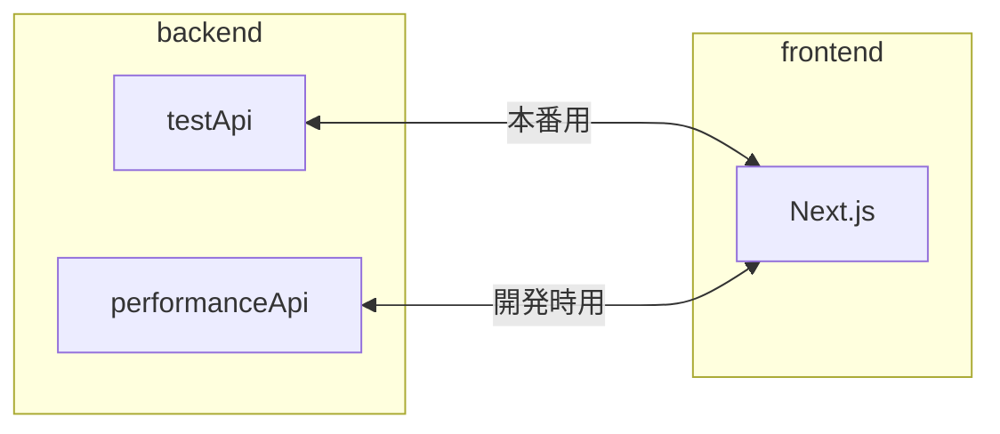

# stableDiffusion4R_API


<p align="center">
    <a href="https://github.com/kumeS/stableDiffusion4R_API" alt="Contributors">
        
    </a>
    <a href="https://github.com/kumeS/stableDiffusion4R_API" alt="Version">
        
    </a>
    <a href="https://github.com/kumeS/stableDiffusion4R_API" alt="forks">
        
    </a>
    <a href="https://github.com/kumeS/stableDiffusion4R_API" alt="forks">
        
    </a>
</p>

## backend

本番環境: backend/performanceApi (plumber を使用)

- LICENSE Apache 2.0
- 使用言語: R
- port: 8000

テスト環境: backend/testApi (Hono を使用)

- LICENSE MIT License
- 使用言語: TypeScript
- port: 8787

## frontend

Next.js: frontend

- LICENSE MIT License
- 使用言語: TypeScript
- port: 3000

## 概略図



### 使用するパッケージマネージャー

#### yarn

### 使用を推奨している Visual Studio Code の拡張機能

#### Prettier - Code formatter

### フロントエンド側の Web API に関係する設定

#### frontend/src/api.ts

```typescript
const testApi: string = "http://127.0.0.1:8787";
const performanceApi: string = "";

const modelType: string[] = ["stableDiffusion4R", "modelA", "modelB", "modelC"];

export { testApi, performanceApi, modelType };
```

testApi ・・・ テスト用の API サーバーの URL を書く

performanceApi 　・・・ 本番用の API サーバーの URL を書く

modelType ・・・ 追加するモデルの名前を書く

フロントエンドでは以下の URL が組み立てられます。

[testURL or performanceURL]/[modelType]/[prompt]

example) http://127.0.0.1:8787/stableDiffusion4R/hello

> [!IMPORTANT]
> frontend/next.config.mjs に、使用するドメインや IP アドレス？を書く必要があります。

#### モデルを追加した際や Web API の URL が変わった際は、フロントエンド側のテストを必ず実行して問題ないことを確認する

frontend/src/`__test__`/generateImg.test.tsx

上記のファイルの中に以下の記述があります。

testCurrentUrl がテスト用の Web API の URL

performanceCurrectUrl が本番用の Web API の URL

```typescript
//*Web APIのサーバーのURLを書く
const testCurrectUrl = "http://127.0.0.1:8787";
const performanceCurrectUrl = "";
```

### テストを実行するためのコマンド

```shell
yarn test
```

or

```shell
yarn test:watch
```

### バックエンドが返すデータ

> [!NOTE]
> tesApi も performanceApi も以下のデータ構造で返します。

```json
{
  "prompt": ["プロンプト"],
  "url": ["画像のURL"]
}
```

### バックエンド側の Web API に関する設定 (テスト環境)

backend/testApi/src/index.ts

> [!IMPORTANT]
> Web API のエンドポイントの名前も modelType に書いた文字列と一致させる必要があります。

> [!NOTE]
> エンドポイントは、`/モデル名/:prompt`で設定する必要があります。

```typescript
import { Hono } from "hono";
import { prettyJSON } from "hono/pretty-json";
import { cors } from "hono/cors";

const app = new Hono();
app.use(prettyJSON());

app.use(
  "/*",
  cors({
    origin: ["http://localhost:3000"],
    allowHeaders: ["*"],
    allowMethods: ["GET"],
    exposeHeaders: ["*"],
    maxAge: 600,
    credentials: true,
  })
);

app.get("/stableDiffusion4R/:prompt", (c) => {
  const prompt = c.req.param("prompt");
  return c.json({
    prompt: prompt,
    url: ["https://yukiosada.work/CG-Animation.webp"],
  });
});

app.get("/modelA/:prompt", (c) => {
  const prompt = c.req.param("prompt");
  return c.json({
    prompt: prompt,
    url: ["https://yukiosada.work/CG-Animation.webp"],
  });
});

app.get("/modelB/:prompt", (c) => {
  const prompt = c.req.param("prompt");
  return c.json({
    prompt: prompt,
    url: ["https://yukiosada.work/CG-Animation.webp"],
  });
});

app.get("/modelC/:prompt", (c) => {
  const prompt = c.req.param("prompt");
  return c.json({
    prompt: prompt,
    url: ["https://yukiosada.work/CG-Animation.webp"],
  });
});

app.get("/modelD/:prompt", (c) => {
  const prompt = c.req.param("prompt");
  return c.json({
    prompt: prompt,
    url: ["https://yukiosada.work/CG-Animation.webp"],
  });
});

export default app;
```

### バックエンド側の Web API に関する設定 (本番環境)

backend/performanceApi/plumber.R

> [!IMPORTANT]
> Web API のエンドポイントの名前も modelType に書いた文字列と一致させる必要があります。

> [!IMPORTANT]
> CORS に関する適切な設定をする必要があります。

以下の設定では、不十分な箇所があります。

```r
#* @filter cors
cors <- function(res) {
  res$setHeader("Access-Control-Allow-Origin", "*")
  res$setHeader("Access-Control-Allow-Method", "GET")
  res$setHeader("Access-Control-Allow-Headers", "*")
  res$setHeader("Access-Control-Allow-Age", 600)
  plumber::forward()
}
```

#### また、エンドポイントを追加した際には、各エンドポイントに以下の 1 行も追加してください。

```r
#* @preempt cors
```

> [!NOTE]
> エンドポイントは、`/モデル名/<prompt>`で設定する必要があります。

```r
library(plumber)
library(stableDiffusion4R)

#以下がCORSに関する設定になります。
#* @filter cors
cors <- function(res) {
  res$setHeader("Access-Control-Allow-Origin", "*")
  res$setHeader("Access-Control-Allow-Method", "GET")
  res$setHeader("Access-Control-Allow-Headers", "*")
  res$setHeader("Access-Control-Allow-Age", 600)
  plumber::forward()
}


#* Generate Dalle Image for R
#* @param prompt プロンプトを入力してください。
#* @preempt cors
#* @get /generateDalleImage4R/<prompt>
function(prompt) {
  content = prompt
  results <- generateDalleImage4R(content, Output_image = F, SaveImg =T)
}

```

### バックエンドのテスト環境の環境構築

※ Node.js 及び yarn がインストールされている前提で書いています。

```shell
cd test_api
yarn
```

### バックエンドのテスト環境のローカルサーバーの起動

最初だけ以下のコマンドを実行する必要があります。

```shell
yarn
```

テスト環境のローカルサーバーの起動

```shell
# backend/testApiディレクトリで
yarn dev
```

### バックエンドの本番環境のローカルサーバーの起動

※ R 及び renv (package 名) がインストールされる前提で書いています。

Windows 環境

```batch
rem backend/performanceApiディレクトリで
plumber.cmd
```

Mac 環境

```shell
# 不明です。
```

### フロントエンドのローカルサーバーの起動

最初だけ以下のコマンドを実行する必要があります。

```shell
yarn
```

フロントエンドのローカルサーバーの起動

※ バックエンドのローカルサーバーも起動しておかないと、画像生成の機能がうまく動作しません。

(現在はポートが 8787 で、ダミーのデータを返すようにしています。)

```shell
# frontendディレクトリで
yarn dev
```

### フロントエンドのビルド

```shell
yarn build
```

### フロントエンドのビルド後のプログラムでローカルサーバーの起動

```shell
yarn start
```
