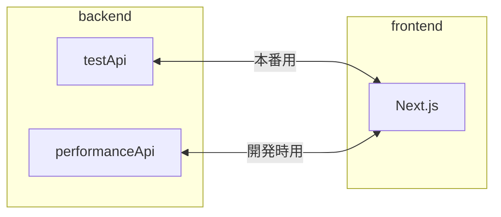

# stableDiffusion4R_API


<p align="center">
    <a href="https://github.com/kumeS/stableDiffusion4R_API" alt="Contributors">
        
    </a>
    <a href="https://github.com/kumeS/stableDiffusion4R_API" alt="Version">
        
    </a>
    <a href="https://github.com/kumeS/stableDiffusion4R_API" alt="forks">
        
    </a>
    <a href="https://github.com/kumeS/stableDiffusion4R_API" alt="forks">
        
    </a>
</p>

## backend

本番環境: backend/performanceApi (plumber を使用)

- LICENSE Apache 2.0
- 使用言語: R
- port: 8000

テスト環境: backend/testApi (Hono を使用)

- LICENSE MIT License
- 使用言語: TypeScript
- port: 8787

## frontend

Next.js: frontend

- LICENSE MIT License
- 使用言語: TypeScript
- port: 3000

storybook: frontend

- コンポーネントのタカログを見るもの
- port: 6006

## docker

> [!NOTE]
> docker のコンテナは、storybook のためのコンテナ・バックエンドのコンテナ・フロントエンドのコンテナの計 3 つが起動します。

### Windows

```batch
gen_dotenv.cmd
docker compose up -d
```

### MacOS / Linux

```shell
sh gen_dotenv.sh
docker compose up -d
```

### ウェブアプリへのアクセス

```text
http://localhost:3000/
```

### storybook が生成したカタログへのアクセス

```text
http://localhost:6006/
```

## 概略図



### フロントエンドで使用するパッケージマネージャー

#### npm

### バックエンドのテスト環境で使用するパッケージマネージャー

#### yarn

### 使用を推奨している Visual Studio Code の拡張機能

#### Prettier - Code formatter

### フロントエンド側の Web API に関係する設定

#### frontend/src/constants/api.ts

```typescript
const modelType: string[] = ["stableDiffusion4R", "modelA", "modelB", "modelC"];

export { testApi, performanceApi, modelType };
```

modelType ・・・ 追加するモデルの名前を書く

フロントエンドでは以下の URL が組み立てられます。

[testURL or performanceURL]/[modelType]/[prompt]

example) http://127.0.0.1:8787/stableDiffusion4R/hello

> [!IMPORTANT]
> frontend/next.config.mjs に、使用するドメインや IP アドレス？を書く必要があります。

#### モデルを追加した際や Web API の URL が変わった際は、フロントエンド側のテストを必ず実行して問題ないことを確認する

frontend/src/`__test__`/generateImg.test.tsx

上記のファイルの中に以下の記述があります。

setCorrectUrl が、Web API の URL

```typescript
//*Web APIのURLを書く
const setCorrectUrl = "http://127.0.0.1:8787";
```

### テストを実行するためのコマンド

```shell
# frontendディレクトリで
npm test
```

or

```shell
# frontendディレクトリで
npm run test:watch
```

### バックエンドが返すデータ

```json
{
  "prompt": ["プロンプト"],
  "url": ["画像のURL"]
}
```

### バックエンド側の Web API に関する設定 (テスト環境)

backend/testApi/src/index.ts

> [!IMPORTANT]
> Web API のエンドポイントの名前も modelType に書いた文字列と一致させる必要があります。

> [!NOTE]
> エンドポイントは、`/モデル名/:prompt`で設定する必要があります。

```typescript
import { serve } from "@hono/node-server";
import { Hono } from "hono";
import { prettyJSON } from "hono/pretty-json";
import { cors } from "hono/cors";

const app = new Hono();
app.use(prettyJSON());

app.use(
  "/*",
  cors({
    origin: ["*"],
    allowHeaders: ["*"],
    allowMethods: ["GET"],
    exposeHeaders: ["*"],
    credentials: true,
  })
);

app.get("/stableDiffusion4R/:prompt", (c) => {
  const prompt = c.req.param("prompt");
  return c.json({
    prompt: [prompt],
    url: ["https://yukiosada.work/CG-Animation.webp"],
  });
});

app.get("/modelA/:prompt", (c) => {
  const prompt = c.req.param("prompt");
  return c.json({
    prompt: prompt,
    url: ["https://yukiosada.work/CG-Animation.webp"],
  });
});

app.get("/modelB/:prompt", (c) => {
  const prompt = c.req.param("prompt");
  return c.json({
    prompt: prompt,
    url: ["https://yukiosada.work/CG-Animation.webp"],
  });
});

app.get("/modelC/:prompt", (c) => {
  const prompt = c.req.param("prompt");
  return c.json({
    prompt: prompt,
    url: ["https://yukiosada.work/CG-Animation.webp"],
  });
});

app.get("/modelD/:prompt", (c) => {
  const prompt = c.req.param("prompt");
  return c.json({
    prompt: prompt,
    url: ["https://yukiosada.work/CG-Animation.webp"],
  });
});

const port = 8787;

console.log(`Server is running on port http://localhost:${port}`);

serve({
  fetch: app.fetch,
  port,
});
```

### バックエンド側の Web API に関する設定 (本番環境)

backend/performanceApi/plumber.R

> [!IMPORTANT]
> Web API のエンドポイントの名前も modelType に書いた文字列と一致させる必要があります。

> [!IMPORTANT]
> CORS に関する適切な設定をする必要があります。

以下の設定では、不十分な箇所があります。

```r
#* @filter cors
cors <- function(req, res) {
  res$setHeader("Access-Control-Allow-Origin", "*")
  if (req$REQUEST_METHOD == "OPTIONS") {
    res$setHeader("Access-Control-Allow-Methods", "GET")
    res$setHeader(
      "Access-Control-Allow-Headers",
      req$HTTP_ACCESS_CONTROL_REQUEST_HEADERS
    )
    res$status <- 200
    return(list())
  } else {
    plumber::forward()
  }
}
```

> [!NOTE]
> エンドポイントは、`/モデル名/<prompt>`で設定する必要があります。

```r
library(plumber)
library(stableDiffusion4R)


#* @filter cors
cors <- function(req, res) {
  res$setHeader("Access-Control-Allow-Origin", "*")
  if (req$REQUEST_METHOD == "OPTIONS") {
    res$setHeader("Access-Control-Allow-Methods", "GET")
    res$setHeader(
      "Access-Control-Allow-Headers",
      req$HTTP_ACCESS_CONTROL_REQUEST_HEADERS
    )
    res$status <- 200
    return(list())
  } else {
    plumber::forward()
  }
}

#* Generate Dalle Image for R
#* @param prompt プロンプトを入力してください。
#* @get /generateDalleImage4R/<prompt>
function(prompt) {
  content <- prompt
  results <- generateDalleImage4R(content, Output_image = F, SaveImg = T)
}

#* 本番のテスト用エンドポイント
#* @param prompt プロンプトを入力してください。
#* @get /modelA/<prompt>
function(prompt) {
  result <- list(prompt=prompt, url=c('https://yukiosada.work/CG-Animation.webp'))
  return(result)
}
```

### バックエンドのテスト環境のローカルサーバーの起動

最初だけ以下のコマンドを実行する必要があります。

```shell
# backend/testApiディレクトリで
yarn
```

テスト環境のローカルサーバーの起動

```shell
# backend/testApiディレクトリで
yarn dev
```

### バックエンドの本番環境のローカルサーバーの起動

※ R 及び renv (package 名) がインストールされる前提で書いています。

Windows 環境

```batch
rem backend/performanceApiディレクトリで
plumber.cmd
```

Mac 環境

```shell
# 不明です。
```

### フロントエンドのローカルサーバーの起動

最初だけ以下のコマンドを実行する必要があります。

```shell
# frontendディレクトリで
npm install
```

フロントエンドのローカルサーバーの起動

※ バックエンドのローカルサーバーも起動しておかないと、画像生成の機能がうまく動作しません。

(現在はポートが 8787 で、ダミーのデータを返すようにしています。)

```shell
# frontendディレクトリで
npm run dev
```

### フロントエンドのコンポーネントのカタログ

storybook を起動することでコンポーネントのカタログを見ることができます。

```shell
# frontendディレクトリで
npm run storybook
```

以下のように、コンポーネントのカタログを見ることができます。


### フロントエンドのビルド

```shell
# frontendディレクトリで
npm run build
```

### フロントエンドのビルド後のプログラムでローカルサーバーの起動

```shell
# frontendディレクトリで
npm start
```
